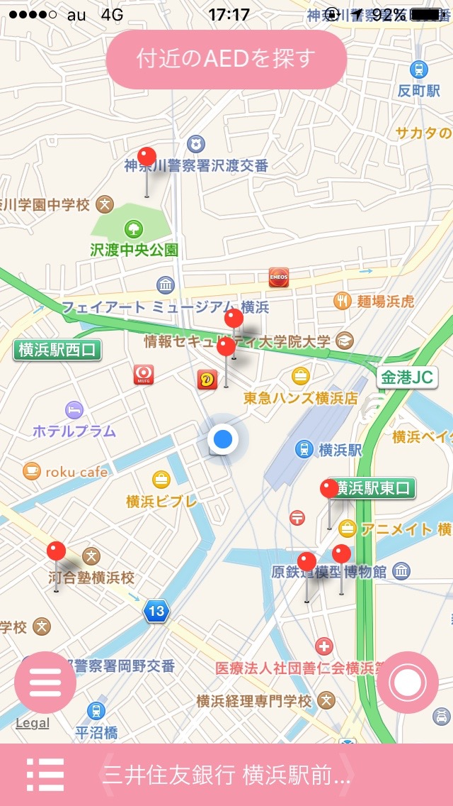
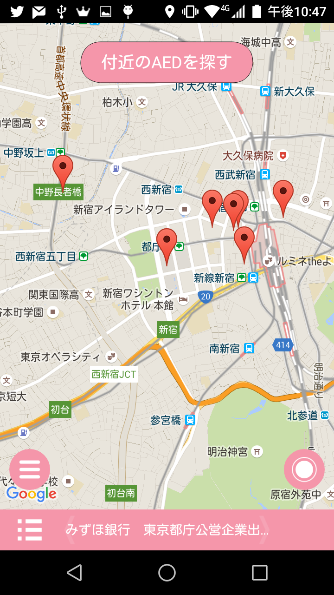

# AEDオープンデータ検索 (XFAedSearch)

「AEDオープンデータ検索」は近くにあるAEDの位置を表示する __Xamarin.Forms__ 製アプリです。
このアプリが参照するAEDの位置情報は AEDオープンデータプラットフォーム(http://hatsunejournal.jp/w8/AEDOpendata/)
に登録されたデータ(各自治体が提供している物)に基づきます。
このアプリは日本国内でのみ動作するアプリケーションです。

## 機能

現在地周辺のAEDを表示します。登録されたAEDがすぐ近くに無い場合でも、半径約2km以内の一番近いAEDを表示します。

## ダウンロード

各ストアにて公開中

__iOS__

__Android__

## Author

[@ticktackmobile](https://twitter.com/ticktackmobile)

## LICENSE

[MIT License](LICENSE)

